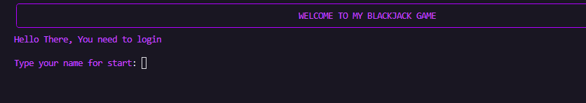

# BlackJack



Um jogo de blackjack feito em linguagem python

### De fork e clone o repositório
- Para com chave Shh

```console
user:~$ git@github.com:LopesLs/BlackJack.git
```

- Para com requisição https

```console
user:~$ git clone https://github.com/LopesLs/BlackJack
```

### Instale o requirements

```console
user:~$ pip install -r requirements.txt
```
